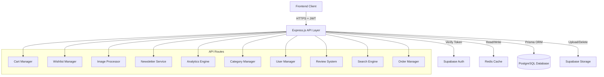
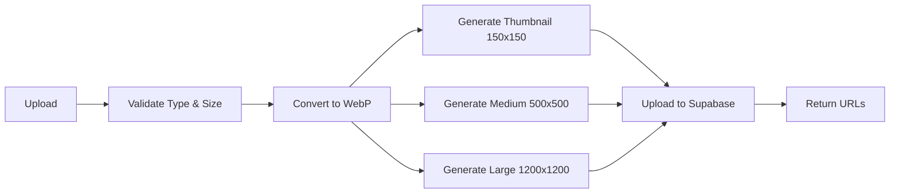

# Technical Design Document

## Overview

This design document specifies the technical implementation for 10 comprehensive backend features that transform the e-commerce platform from a client-side prototype to a production-ready system. The implementation migrates cart and favorites from localStorage to secure server-side APIs, adds enterprise-grade admin capabilities, implements a complete review system, and enhances product discovery with intelligent search and recommendations.

### System Context

The e-commerce platform is built on:
- **Backend**: Express.js with serverless deployment on Vercel
- **Database**: PostgreSQL accessed via Prisma ORM with connection pooling
- **Cache**: Redis (Upstash) for performance optimization
- **Storage**: Supabase Storage with CDN for image hosting
- **Authentication**: Supabase Auth with JWT tokens

### Design Goals

1. **Security**: All sensitive operations require authentication; admin operations require role verification
2. **Performance**: Aggressive caching with Redis; sub-second response times for cached data
3. **Scalability**: Stateless serverless architecture; connection pooling for database
4. **Data Integrity**: Referential integrity via foreign keys; transactional operations where needed
5. **User Experience**: Seamless migration from localStorage to server-side storage
6. **Maintainability**: Clear separation of concerns; reusable middleware patterns

## Architecture

### High-Level Architecture



### Request Flow Patterns

#### Authenticated Read Request with Caching
```
Client → API → Auth Middleware → Cache Check → [HIT: Return] or [MISS: DB Query → Cache Store → Return]
```

#### Authenticated Write Request with Cache Invalidation
```
Client → API → Auth Middleware → Validate Input → DB Write → Cache Invalidate → Return
```

#### Admin Request
```
Client → API → Auth Middleware → Admin Middleware → DB Operation → Cache Invalidate → Return
```

#### Image Upload Request
```
Client → API → Auth + Admin → Validate File → Compress to WebP → Generate Sizes → Upload to Storage → Return URLs
```

### Middleware Stack

1. **express.json()**: Parse JSON request bodies (10MB limit for image uploads)
2. **helmet()**: Security headers
3. **cors()**: Cross-origin resource sharing
4. **rateLimit()**: Rate limiting (60 req/min for public endpoints)
5. **verifyToken()**: JWT authentication
6. **requireAdmin()**: Admin role verification
7. **cacheMiddleware()**: Redis caching layer

## Components and Interfaces

### 1. Cart Manager

**Responsibility**: Manage server-side shopping cart operations

**API Endpoints**:

```typescript
POST   /api/cart
GET    /api/cart
PUT    /api/cart/:itemId
DELETE /api/cart/:itemId
DELETE /api/cart
```

**Request/Response Schemas**:

```typescript
// POST /api/cart - Add item
Request: {
  productId: string (UUID)
  quantity: number (positive integer)
}
Response: {
  id: string
  userId: string
  productId: string
  quantity: number
  createdAt: string (ISO 8601)
  updatedAt: string (ISO 8601)
  product: {
    id: string
    title: string
    price: number
    image: string
    stock: number
  }
}

// GET /api/cart - Get cart
Response: {
  items: CartItem[]
  subtotal: number
  itemCount: number
}

// PUT /api/cart/:itemId - Update quantity
Request: {
  quantity: number (positive integer)
}
Response: CartItem

// DELETE /api/cart/:itemId - Remove item
Response: { success: true }

// DELETE /api/cart - Clear cart
Response: { success: true, deletedCount: number }
```

**Business Logic**:
- Validate product exists and has sufficient stock before add/update
- Calculate subtotal and item count server-side
- Automatically remove cart items when product is deleted (cascade)
- Support merging localStorage cart on first login

**Error Handling**:
- 400: Invalid product ID, invalid quantity, insufficient stock
- 401: Missing or invalid authentication
- 404: Cart item not found
- 500: Database error

### 2. Wishlist Manager

**Responsibility**: Manage server-side favorites/wishlist

**API Endpoints**:

```typescript
POST   /api/favorites
GET    /api/favorites
DELETE /api/favorites/:productId
```

**Request/Response Schemas**:

```typescript
// POST /api/favorites - Add to favorites
Request: {
  productId: string (UUID)
}
Response: {
  id: string
  userId: string
  productId: string
  createdAt: string (ISO 8601)
  product: Product
}

// GET /api/favorites - Get favorites
Response: {
  favorites: Favorite[]
}

// DELETE /api/favorites/:productId - Remove from favorites
Response: { success: true }
```

**Business Logic**:
- Validate product exists before adding
- Prevent duplicate favorites (unique constraint on userId + productId)
- Return success for duplicate add (idempotent operation)
- Sort by most recently added first
- Automatically remove favorites when product is deleted (cascade)

**Error Handling**:
- 400: Invalid product ID
- 401: Missing or invalid authentication
- 404: Product not found
- 500: Database error

### 3. Image Processor

**Responsibility**: Handle image upload, compression, and storage management

**API Endpoints**:

```typescript
POST   /api/upload/image
POST   /api/upload/images
DELETE /api/upload/image
```

**Request/Response Schemas**:

```typescript
// POST /api/upload/image - Upload single image
Request: multipart/form-data {
  image: File (max 10MB, types: image/jpeg, image/png, image/gif, image/webp)
}
Response: {
  thumbnail: string (URL)
  medium: string (URL)
  large: string (URL)
}

// POST /api/upload/images - Upload multiple images
Request: multipart/form-data {
  images: File[] (max 10MB each)
}
Response: {
  images: Array<{
    thumbnail: string
    medium: string
    large: string
  }>
}

// DELETE /api/upload/image - Delete image
Request: {
  imageUrl: string (full URL or path)
}
Response: { success: true }
```

**Image Processing Pipeline**:



**Technical Implementation**:
- Use `sharp` library for image processing
- WebP compression with quality 80
- Maintain aspect ratio with cover fit
- Generate unique filenames: `{timestamp}-{uuid}-{size}.webp`
- Upload to Supabase Storage bucket: `product-images`
- Set public read access, authenticated write access via RLS

**Business Logic**:
- Validate file type using MIME type and magic bytes
- Validate file size ≤ 10MB
- Generate three sizes for responsive images
- Delete old images when product image is updated
- Delete all images when product is deleted

**Error Handling**:
- 400: Invalid file type, file too large, missing file
- 401: Missing or invalid authentication
- 403: Not an admin user
- 500: Image processing error, storage upload error

### 4. Newsletter Service

**Responsibility**: Manage email subscriptions for marketing

**API Endpoints**:

```typescript
POST   /api/newsletter/subscribe
GET    /api/newsletter/subscribers (admin)
DELETE /api/newsletter/:email
```

**Request/Response Schemas**:

```typescript
// POST /api/newsletter/subscribe - Subscribe
Request: {
  email: string (valid email format)
}
Response: {
  email: string
  subscribedAt: string (ISO 8601)
}

// GET /api/newsletter/subscribers - List subscribers (admin)
Query: {
  page?: number (default 1)
  limit?: number (default 20, max 50)
}
Response: {
  subscribers: Array<{
    email: string
    subscribedAt: string
  }>
  pagination: {
    page: number
    limit: number
    total: number
    totalPages: number
  }
}

// DELETE /api/newsletter/:email - Unsubscribe
Response: { success: true }
```

**Business Logic**:
- Validate email format using regex
- Prevent duplicate subscriptions (unique constraint on email)
- Return success for duplicate subscribe (idempotent)
- Store subscription timestamp for GDPR compliance
- Support pagination for admin list view

**Error Handling**:
- 400: Invalid email format
- 401: Missing authentication (admin endpoints)
- 403: Not an admin user (admin endpoints)
- 404: Email not found (unsubscribe)
- 500: Database error

### 5. Analytics Engine

**Responsibility**: Calculate and cache business metrics for admin dashboard

**API Endpoints**:

```typescript
GET /api/admin/analytics
```

**Response Schema**:

```typescript
Response: {
  revenue: {
    allTime: number
    currentMonth: number
    currentWeek: number
  }
  orders: {
    total: number
    pending: number
    completed: number
    statusBreakdown: {
      pending: number
      processing: number
      completed: number
      cancelled: number
    }
  }
  customers: {
    total: number
  }
  products: {
    total: number
  }
  topProducts: Array<{
    id: string
    title: string
    image: string
    orderCount: number
    revenue: number
  }>
  recentOrders: Array<{
    id: string
    totalAmount: number
    status: string
    createdAt: string
    user: {
      email: string
      fullName: string
    }
  }>
  dailyRevenue: Array<{
    date: string (YYYY-MM-DD)
    revenue: number
  }>
}
```

**Aggregation Queries**:

```sql
-- Total revenue
SELECT SUM(total_amount) FROM orders WHERE status = 'Completed'

-- Monthly revenue
SELECT SUM(total_amount) FROM orders 
WHERE status = 'Completed' 
AND created_at >= date_trunc('month', CURRENT_DATE)

-- Weekly revenue
SELECT SUM(total_amount) FROM orders 
WHERE status = 'Completed' 
AND created_at >= date_trunc('week', CURRENT_DATE)

-- Order counts by status
SELECT status, COUNT(*) FROM orders GROUP BY status

-- Top 5 products
SELECT p.id, p.title, p.image, p.orders as order_count,
       SUM(oi.quantity * oi.price) as revenue
FROM products p
JOIN order_items oi ON p.id = oi.product_id
JOIN orders o ON oi.order_id = o.id
WHERE o.status = 'Completed'
GROUP BY p.id
ORDER BY order_count DESC
LIMIT 5

-- Daily revenue (last 7 days)
SELECT DATE(created_at) as date, SUM(total_amount) as revenue
FROM orders
WHERE status = 'Completed'
AND created_at >= CURRENT_DATE - INTERVAL '7 days'
GROUP BY DATE(created_at)
ORDER BY date ASC
```

**Caching Strategy**:
- Cache key: `analytics:dashboard`
- TTL: 5 minutes (300 seconds)
- Invalidate on: order status change, product update, new order

**Performance Optimization**:
- Use database indexes on: orders.status, orders.created_at, products.orders
- Execute queries in parallel using Promise.all()
- Return cached data within 200ms
- Execute fresh queries within 1 second

**Error Handling**:
- 401: Missing authentication
- 403: Not an admin user
- 500: Database query error

### 6. Category Manager

**Responsibility**: CRUD operations for product categories

**API Endpoints**:

```typescript
POST   /api/categories (admin)
PUT    /api/categories/:id (admin)
DELETE /api/categories/:id (admin)
GET    /api/categories (public, existing)
```

**Request/Response Schemas**:

```typescript
// POST /api/categories - Create category
Request: {
  name: string (unique, 1-100 chars)
  icon?: string (URL)
}
Response: {
  id: string
  name: string
  slug: string (auto-generated)
  icon: string | null
  createdAt: string
}

// PUT /api/categories/:id - Update category
Request: {
  name?: string (unique if changed)
  icon?: string (URL)
}
Response: Category

// DELETE /api/categories/:id - Delete category
Response: { success: true }

// GET /api/categories - List categories (existing endpoint)
Response: {
  categories: Array<{
    id: string
    name: string
    slug: string
    icon: string | null
    productCount: number
  }>
}
```

**Business Logic**:
- Auto-generate URL-safe slug from name: lowercase, replace spaces with hyphens, remove special chars
- Validate name uniqueness before create/update
- Validate slug uniqueness (auto-generated, should always be unique)
- Prevent deletion if category has associated products
- Invalidate category cache on create/update/delete

**Slug Generation Algorithm**:
```javascript
function generateSlug(name) {
  return name
    .toLowerCase()
    .trim()
    .replace(/[^\w\s-]/g, '') // Remove special characters
    .replace(/\s+/g, '-')      // Replace spaces with hyphens
    .replace(/-+/g, '-');      // Replace multiple hyphens with single
}
```

**Cache Invalidation**:
- Invalidate keys: `categories:*`, `products:*` (categories affect product listings)

**Error Handling**:
- 400: Invalid name, duplicate name, duplicate slug
- 401: Missing authentication
- 403: Not an admin user
- 404: Category not found
- 409: Cannot delete category with products
- 500: Database error

### 7. User Manager

**Responsibility**: Admin operations for user account management

**API Endpoints**:

```typescript
GET /api/admin/users
GET /api/admin/users/:id
PUT /api/admin/users/:id/role
GET /api/admin/users/:id/orders
```

**Request/Response Schemas**:

```typescript
// GET /api/admin/users - List users
Query: {
  page?: number (default 1)
  limit?: number (default 20, max 50)
  search?: string (email or full name)
}
Response: {
  users: Array<{
    id: string
    email: string
    fullName: string | null
    isAdmin: boolean
    createdAt: string
  }>
  pagination: {
    page: number
    limit: number
    total: number
    totalPages: number
  }
}

// GET /api/admin/users/:id - Get user details
Response: {
  id: string
  email: string
  fullName: string | null
  avatarUrl: string | null
  isAdmin: boolean
  createdAt: string
  updatedAt: string
  orderCount: number
  totalSpent: number
}

// PUT /api/admin/users/:id/role - Update admin status
Request: {
  isAdmin: boolean
}
Response: {
  id: string
  email: string
  isAdmin: boolean
}

// GET /api/admin/users/:id/orders - Get user orders
Query: {
  page?: number (default 1)
  limit?: number (default 20, max 50)
}
Response: {
  orders: Array<{
    id: string
    totalAmount: number
    status: string
    createdAt: string
    itemCount: number
  }>
  pagination: PaginationInfo
}
```

**Business Logic**:
- Search users by email or full name (case-insensitive, partial match)
- Sort users by creation date (newest first)
- Prevent admin from revoking their own admin privileges
- Calculate user statistics (order count, total spent) on detail view
- Validate user existence before any operation

**Search Implementation**:
```sql
SELECT * FROM profiles
WHERE LOWER(email) LIKE LOWER('%' || $search || '%')
   OR LOWER(full_name) LIKE LOWER('%' || $search || '%')
ORDER BY created_at DESC
LIMIT $limit OFFSET $offset
```

**Error Handling**:
- 400: Invalid user ID, cannot revoke own admin
- 401: Missing authentication
- 403: Not an admin user
- 404: User not found
- 500: Database error

### 8. Review System

**Responsibility**: Manage product reviews and ratings

**API Endpoints**:

```typescript
POST   /api/products/:id/reviews
GET    /api/products/:id/reviews
PUT    /api/reviews/:id
DELETE /api/reviews/:id
```

**Request/Response Schemas**:

```typescript
// POST /api/products/:id/reviews - Add review
Request: {
  rating: number (1-5)
  comment: string (non-empty, max 2000 chars)
}
Response: {
  id: string
  userId: string
  productId: string
  rating: number
  comment: string
  createdAt: string
  updatedAt: string
  user: {
    fullName: string
    avatarUrl: string | null
  }
}

// GET /api/products/:id/reviews - Get reviews
Query: {
  page?: number (default 1)
  limit?: number (default 10, max 50)
}
Response: {
  reviews: Array<{
    id: string
    rating: number
    comment: string
    createdAt: string
    user: {
      fullName: string
      avatarUrl: string | null
    }
  }>
  pagination: PaginationInfo
  averageRating: number
  totalReviews: number
}

// PUT /api/reviews/:id - Update review
Request: {
  rating?: number (1-5)
  comment?: string (non-empty)
}
Response: Review

// DELETE /api/reviews/:id - Delete review
Response: { success: true }
```

**Business Logic**:
- Validate user has purchased the product before allowing review
- Validate rating is between 1 and 5
- Validate comment is non-empty
- Prevent duplicate reviews (unique constraint on userId + productId)
- Recalculate product average rating after create/update/delete
- Allow user to update/delete their own review
- Allow admin to delete any review
- Sort reviews by most recent first

**Purchase Validation Query**:
```sql
SELECT EXISTS(
  SELECT 1 FROM orders o
  JOIN order_items oi ON o.id = oi.order_id
  WHERE o.user_id = $userId
    AND oi.product_id = $productId
    AND o.status = 'Completed'
) as has_purchased
```

**Average Rating Calculation**:
```sql
UPDATE products
SET rating = (
  SELECT COALESCE(AVG(rating), 0)
  FROM product_reviews
  WHERE product_id = $productId
)
WHERE id = $productId
```

**Cache Invalidation**:
- Invalidate keys: `products:${productId}`, `products:*`, `reviews:${productId}:*`

**Error Handling**:
- 400: Invalid rating, empty comment, duplicate review, user has not purchased
- 401: Missing authentication
- 403: Not review owner (update/delete)
- 404: Review not found, product not found
- 500: Database error

### 9. Search Engine

**Responsibility**: Product discovery through search, recommendations, and curated lists

**API Endpoints**:

```typescript
GET /api/products/search/suggestions
GET /api/products/related/:id
GET /api/products/trending
GET /api/products/deals
```

**Request/Response Schemas**:

```typescript
// GET /api/products/search/suggestions - Autocomplete
Query: {
  q: string (search query, min 1 char)
}
Response: {
  suggestions: Array<{
    id: string
    title: string
    price: number
    image: string
  }>
}

// GET /api/products/related/:id - Related products
Response: {
  products: Product[] (max 8)
}

// GET /api/products/trending - Trending products
Query: {
  limit?: number (default 10, max 50)
}
Response: {
  products: Product[]
}

// GET /api/products/deals - Products with discounts
Query: {
  limit?: number (default 10, max 50)
}
Response: {
  products: Product[]
}
```

**Search Algorithms**:

**Autocomplete Suggestions**:
```sql
SELECT id, title, price, image
FROM products
WHERE LOWER(title) LIKE LOWER($query || '%')
ORDER BY orders DESC, rating DESC
LIMIT 10
```

**Related Products**:
```sql
SELECT * FROM products
WHERE category_id = (SELECT category_id FROM products WHERE id = $productId)
  AND id != $productId
ORDER BY rating DESC, orders DESC
LIMIT 8
```

**Trending Products**:
```sql
SELECT * FROM products
ORDER BY orders DESC, rating DESC
LIMIT $limit
```

**Deals**:
```sql
SELECT * FROM products
WHERE old_price IS NOT NULL AND old_price > price
ORDER BY (old_price - price) / old_price DESC
LIMIT $limit
```

**Caching Strategy**:
- Search suggestions: TTL 1 hour, key `search:suggestions:${query}`
- Related products: TTL 2 hours, key `products:related:${productId}`
- Trending: TTL 30 minutes, key `products:trending:${limit}`
- Deals: TTL 1 hour, key `products:deals:${limit}`

**Cache Invalidation**:
- Invalidate on product update, product delete, order completion

**Error Handling**:
- 400: Missing or invalid query parameter
- 404: Product not found (related products)
- 500: Database error

### 10. Order Manager (Enhancements)

**Responsibility**: Add shipping details and tracking to existing order system

**Enhanced Order Schema**:

```typescript
Order {
  // Existing fields
  id: string
  userId: string
  totalAmount: number
  status: string
  createdAt: string
  updatedAt: string
  items: OrderItem[]
  
  // New fields
  shippingAddress: {
    street: string
    city: string
    state: string
    postalCode: string
    country: string
  }
  paymentMethod: string
  trackingNumber: string | null
  notes: string | null
}
```

**API Enhancements**:

```typescript
// POST /api/orders - Create order (enhanced)
Request: {
  items: Array<{ productId: string, quantity: number }>
  shippingAddress: {
    street: string (required)
    city: string (required)
    state: string (required)
    postalCode: string (required)
    country: string (required)
  }
  paymentMethod: string (required, e.g., "Credit Card", "PayPal")
  notes?: string (optional, max 1000 chars)
}

// PUT /api/admin/orders/:id - Update order (admin)
Request: {
  status?: string
  trackingNumber?: string
}

// GET /api/orders/:id - Get order details (enhanced response)
Response: Order (with all new fields)
```

**Validation Rules**:
- Shipping address: all fields required, non-empty strings
- Payment method: required, non-empty string
- Notes: optional, max 1000 characters
- Tracking number: optional, alphanumeric string

**Business Logic**:
- Store shipping address as JSON for schema flexibility
- Validate all required shipping fields before order creation
- Allow admin to update tracking number and status
- Return complete order details including shipping info

**Error Handling**:
- 400: Missing required shipping fields, invalid payment method
- 401: Missing authentication
- 403: Not an admin user (admin endpoints)
- 404: Order not found
- 500: Database error

## Data Models

### New Tables

#### cart_items
```prisma
model CartItem {
  id        String   @id @default(dbgenerated("gen_random_uuid()")) @db.Uuid
  userId    String   @map("user_id") @db.Uuid
  productId String   @map("product_id") @db.Uuid
  quantity  Int
  createdAt DateTime @default(dbgenerated("timezone('utc'::text, now())")) @map("created_at") @db.Timestamptz(6)
  updatedAt DateTime @default(dbgenerated("timezone('utc'::text, now())")) @map("updated_at") @db.Timestamptz(6)
  
  user    Profile @relation(fields: [userId], references: [id], onDelete: Cascade)
  product Product @relation(fields: [productId], references: [id], onDelete: Cascade)
  
  @@unique([userId, productId])
  @@index([userId])
  @@index([productId])
  @@map("cart_items")
  @@schema("public")
}
```

#### favorites
```prisma
model Favorite {
  id        String   @id @default(dbgenerated("gen_random_uuid()")) @db.Uuid
  userId    String   @map("user_id") @db.Uuid
  productId String   @map("product_id") @db.Uuid
  createdAt DateTime @default(dbgenerated("timezone('utc'::text, now())")) @map("created_at") @db.Timestamptz(6)
  
  user    Profile @relation(fields: [userId], references: [id], onDelete: Cascade)
  product Product @relation(fields: [productId], references: [id], onDelete: Cascade)
  
  @@unique([userId, productId])
  @@index([userId])
  @@index([productId])
  @@map("favorites")
  @@schema("public")
}
```

#### newsletter_subscribers
```prisma
model NewsletterSubscriber {
  id           String   @id @default(dbgenerated("gen_random_uuid()")) @db.Uuid
  email        String   @unique
  subscribedAt DateTime @default(dbgenerated("timezone('utc'::text, now())")) @map("subscribed_at") @db.Timestamptz(6)
  
  @@index([email])
  @@map("newsletter_subscribers")
  @@schema("public")
}
```

#### product_reviews
```prisma
model ProductReview {
  id        String   @id @default(dbgenerated("gen_random_uuid()")) @db.Uuid
  userId    String   @map("user_id") @db.Uuid
  productId String   @map("product_id") @db.Uuid
  rating    Int      @db.SmallInt // 1-5
  comment   String   @db.Text
  createdAt DateTime @default(dbgenerated("timezone('utc'::text, now())")) @map("created_at") @db.Timestamptz(6)
  updatedAt DateTime @default(dbgenerated("timezone('utc'::text, now())")) @map("updated_at") @db.Timestamptz(6)
  
  user    Profile @relation(fields: [userId], references: [id], onDelete: Cascade)
  product Product @relation(fields: [productId], references: [id], onDelete: Cascade)
  
  @@unique([userId, productId])
  @@index([productId])
  @@index([userId])
  @@index([rating])
  @@map("product_reviews")
  @@schema("public")
}
```

### Modified Tables

#### orders (add columns)
```prisma
model Order {
  // ... existing fields ...
  
  shippingAddress Json?    @map("shipping_address") @db.Json
  paymentMethod   String?  @map("payment_method")
  trackingNumber  String?  @map("tracking_number")
  notes           String?  @db.Text
  
  // ... existing relations ...
}
```

### Database Indexes

**Performance-Critical Indexes**:
- `cart_items(user_id)` - Fast cart retrieval
- `favorites(user_id)` - Fast favorites retrieval
- `product_reviews(product_id)` - Fast review listing
- `product_reviews(rating)` - Fast rating aggregation
- `products(orders)` - Trending products query
- `products(old_price, price)` - Deals query
- `orders(status, created_at)` - Analytics queries

### Referential Integrity

**Cascade Deletes**:
- When user deleted → delete cart_items, favorites, product_reviews
- When product deleted → delete cart_items, favorites, product_reviews

**Prevent Deletes**:
- Cannot delete category if products exist in that category

## Correctness Properties

*A property is a characteristic or behavior that should hold true across all valid executions of a system—essentially, a formal statement about what the system should do. Properties serve as the bridge between human-readable specifications and machine-verifiable correctness guarantees.*

### Property 1: Image Format Validation

*For any* uploaded file, the Image_Processor SHALL accept the file if and only if its MIME type is one of image/jpeg, image/png, image/gif, or image/webp.

**Validates: Requirements 1.1**

### Property 2: Image Size Validation

*For any* uploaded image file, the Image_Processor SHALL accept the file if and only if its size is less than or equal to 10MB (10,485,760 bytes).

**Validates: Requirements 1.2**

### Property 3: WebP Compression Output

*For any* valid uploaded image, the Image_Processor SHALL produce output files in WebP format with MIME type image/webp.

**Validates: Requirements 1.3**

### Property 4: Multi-Size Image Generation

*For any* valid uploaded image, the Image_Processor SHALL generate exactly three output files with dimensions 150x150 (thumbnail), 500x500 (medium), and 1200x1200 (large), maintaining aspect ratio.

**Validates: Requirements 1.4**

### Property 5: Secure URL Generation

*For any* successfully uploaded image set, the Image_Processor SHALL return three URLs that all start with "https://" and point to accessible resources.

**Validates: Requirements 1.6**

### Property 6: Image Cleanup on Update

*For any* product with existing images, when new images are uploaded, the Image_Processor SHALL delete all old image files from storage before returning the new URLs.

**Validates: Requirements 1.7**

### Property 7: Image Cleanup on Product Deletion

*For any* product with associated images, when the product is deleted, the Image_Processor SHALL delete all associated image files (thumbnail, medium, large) from storage.

**Validates: Requirements 1.8**

### Property 8: Independent Multi-Image Processing

*For any* array of N valid images uploaded together, the Image_Processor SHALL return exactly N sets of URLs, where each set contains three URLs (thumbnail, medium, large).

**Validates: Requirements 1.10**

### Property 9: Product Existence Validation

*For any* product ID provided in cart or favorites operations, the system SHALL accept the operation if and only if a product with that ID exists in the database.

**Validates: Requirements 2.1, 3.1**

### Property 10: Stock Validation

*For any* product and requested quantity, the Cart_Manager SHALL accept the add or update operation if and only if the requested quantity is less than or equal to the product's available stock.

**Validates: Requirements 2.2, 2.5**

### Property 11: Cart Item Upsert Behavior

*For any* user and product, when the user adds the product to their cart multiple times, the Cart_Manager SHALL maintain exactly one cart item for that product with the quantity equal to the sum of all add operations.

**Validates: Requirements 2.3**

### Property 12: Cart Data Completeness

*For any* user's cart, when retrieved, the Cart_Manager SHALL return all cart items with complete product details including id, title, price, image, and stock for each item.

**Validates: Requirements 2.4**

### Property 13: Cart Item Deletion

*For any* cart item, when removed, the Cart_Manager SHALL delete the item from the database such that subsequent cart retrievals do not include that item.

**Validates: Requirements 2.6**

### Property 14: Cart Clear Operation

*For any* user's cart containing N items, when cleared, the Cart_Manager SHALL delete all N items such that subsequent cart retrievals return an empty cart with itemCount = 0.

**Validates: Requirements 2.7**

### Property 15: Cascade Deletion for Products

*For any* product that exists in M users' carts and N users' favorites, when the product is deleted, the system SHALL automatically remove the product from all M carts and all N favorites.

**Validates: Requirements 2.8, 3.6**

### Property 16: LocalStorage Merge on First Login

*For any* user logging in for the first time with L items in localStorage cart and S items in server cart, the Cart_Manager SHALL merge them such that the final cart contains all unique products with combined quantities for duplicates.

**Validates: Requirements 2.9, 3.7**

### Property 17: Cart Total Calculation

*For any* cart with items [(product1, quantity1, price1), (product2, quantity2, price2), ...], the Cart_Manager SHALL calculate subtotal = Σ(quantity_i × price_i) and itemCount = Σ(quantity_i).

**Validates: Requirements 2.10**

### Property 18: Favorite Creation

*For any* valid product, when added to favorites, the Wishlist_Manager SHALL create a favorite record with userId, productId, and createdAt timestamp.

**Validates: Requirements 3.2**

### Property 19: Idempotent Favorite Addition

*For any* product already in a user's favorites, when added again, the Wishlist_Manager SHALL return success without creating a duplicate record, maintaining exactly one favorite record for that user-product pair.

**Validates: Requirements 3.3, 4.4**

### Property 20: Favorites Data Completeness

*For any* user's favorites, when retrieved, the Wishlist_Manager SHALL return all favorited products with complete product details.

**Validates: Requirements 3.4**

### Property 21: Favorite Deletion

*For any* favorite record, when removed, the Wishlist_Manager SHALL delete the record such that subsequent favorites retrievals do not include that product.

**Validates: Requirements 3.5**

### Property 22: Temporal Ordering

*For any* list of items with creation timestamps (favorites, users, reviews), when retrieved without explicit sorting parameters, the system SHALL return items ordered by createdAt in descending order (most recent first).

**Validates: Requirements 3.8, 7.9, 8.11**

### Property 23: Email Format Validation

*For any* string submitted as an email address, the Newsletter_Service SHALL accept it if and only if it matches the pattern: one or more characters, followed by @, followed by one or more characters, followed by a dot, followed by two or more characters.

**Validates: Requirements 4.1**

### Property 24: Subscription Record Creation

*For any* valid email not already subscribed, when submitted for subscription, the Newsletter_Service SHALL create a record with the email and a subscribedAt timestamp.

**Validates: Requirements 4.3**

### Property 25: Pagination Behavior

*For any* paginated endpoint with total T items, page P, and limit L, the system SHALL return items from index (P-1)×L to min(P×L-1, T-1) and include pagination metadata with correct page, limit, total, and totalPages values.

**Validates: Requirements 4.5, 4.7, 7.1, 8.10**

### Property 26: Subscription Deletion

*For any* subscribed email, when unsubscribed, the Newsletter_Service SHALL delete the subscription record such that subsequent subscriber list retrievals do not include that email.

**Validates: Requirements 4.6**

### Property 27: Subscription Timestamp Storage

*For any* newsletter subscription, the Newsletter_Service SHALL store a subscribedAt timestamp that represents the date and time of subscription.

**Validates: Requirements 4.8**

### Property 28: Revenue Calculation Correctness

*For any* set of completed orders with amounts [a1, a2, ..., an], the Analytics_Engine SHALL calculate total revenue = Σ(ai), monthly revenue = Σ(ai where order date in current month), and weekly revenue = Σ(ai where order date in current week).

**Validates: Requirements 5.1**

### Property 29: Order Count Aggregation

*For any* set of orders, the Analytics_Engine SHALL calculate total count = COUNT(*), pending count = COUNT(* WHERE status='Pending'), completed count = COUNT(* WHERE status='Completed'), and status breakdown = COUNT(*) GROUP BY status.

**Validates: Requirements 5.2, 5.8**

### Property 30: Entity Count Aggregation

*For any* database state, the Analytics_Engine SHALL calculate customer count = COUNT(profiles), product count = COUNT(products).

**Validates: Requirements 5.3, 5.4**

### Property 31: Top Products Ranking

*For any* set of products with order counts, the Analytics_Engine SHALL return the top 5 products ordered by order count in descending order.

**Validates: Requirements 5.5**

### Property 32: Recent Orders Retrieval

*For any* set of orders, the Analytics_Engine SHALL return the 10 most recent orders ordered by createdAt in descending order, including customer and status information.

**Validates: Requirements 5.6**

### Property 33: Daily Revenue Aggregation

*For any* set of completed orders in the last 7 days, the Analytics_Engine SHALL calculate daily revenue = SUM(totalAmount) GROUP BY DATE(createdAt) for each day.

**Validates: Requirements 5.7**

### Property 34: Analytics Cache Behavior

*For any* analytics request, if a cached result exists and is less than 5 minutes old, the Analytics_Engine SHALL return the cached result; otherwise, it SHALL execute fresh queries and cache the result for 5 minutes.

**Validates: Requirements 5.9**

### Property 35: Category Name Uniqueness

*For any* category name, the Category_Manager SHALL accept a create or update operation if and only if no other category has the same name (case-sensitive comparison).

**Validates: Requirements 6.1, 6.4, 6.10**

### Property 36: Slug Generation from Name

*For any* category name, the Category_Manager SHALL generate a slug by converting to lowercase, replacing spaces with hyphens, removing special characters, and ensuring the result is URL-safe.

**Validates: Requirements 6.2**

### Property 37: Category Data Persistence

*For any* category create operation with name and optional icon, the Category_Manager SHALL store a record with id, name, slug (auto-generated), icon, and createdAt timestamp.

**Validates: Requirements 6.3**

### Property 38: Conditional Slug Regeneration

*For any* category update operation, the Category_Manager SHALL regenerate the slug if and only if the name field is changed; if the name is unchanged, the slug SHALL remain the same.

**Validates: Requirements 6.5**

### Property 39: Category Deletion Prevention

*For any* category with N associated products where N > 0, the Category_Manager SHALL reject deletion requests and return an error indicating the category has associated products.

**Validates: Requirements 6.6, 6.7**

### Property 40: Category Product Count

*For any* category, when retrieved in list view, the Category_Manager SHALL include a productCount field equal to COUNT(products WHERE categoryId = category.id).

**Validates: Requirements 6.9**

### Property 41: User List Data Completeness

*For any* user in the system, when included in the user list response, the User_Manager SHALL include id, email, fullName, isAdmin, and createdAt fields.

**Validates: Requirements 7.2**

### Property 42: User Search Filtering

*For any* search query Q, the User_Manager SHALL return users where LOWER(email) contains LOWER(Q) OR LOWER(fullName) contains LOWER(Q).

**Validates: Requirements 7.3**

### Property 43: User Detail Completeness

*For any* user ID, when user details are requested, the User_Manager SHALL return complete profile information including id, email, fullName, avatarUrl, isAdmin, createdAt, and updatedAt.

**Validates: Requirements 7.4**

### Property 44: Admin Privilege Update

*For any* user and boolean value B, when admin privileges are granted or revoked, the User_Manager SHALL update the user's isAdmin field to B.

**Validates: Requirements 7.5, 7.6**

### Property 45: Self-Revocation Prevention

*For any* admin user attempting to revoke their own admin privileges, the User_Manager SHALL reject the operation and return an error.

**Validates: Requirements 7.7**

### Property 46: User Order History Retrieval

*For any* user ID, when order history is requested, the User_Manager SHALL return all orders where userId = user.id, including order details.

**Validates: Requirements 7.8**

### Property 47: User Existence Validation

*For any* user ID provided in update operations, the User_Manager SHALL accept the operation if and only if a user with that ID exists in the database.

**Validates: Requirements 7.10**

### Property 48: Purchase Validation for Reviews

*For any* user and product, the Review_System SHALL allow review submission if and only if EXISTS(order WHERE userId = user.id AND status = 'Completed' AND EXISTS(orderItem WHERE orderId = order.id AND productId = product.id)).

**Validates: Requirements 8.1**

### Property 49: Rating Range Validation

*For any* rating value R, the Review_System SHALL accept the review if and only if R is an integer and 1 ≤ R ≤ 5.

**Validates: Requirements 8.2**

### Property 50: Comment Non-Empty Validation

*For any* comment string C, the Review_System SHALL accept the review if and only if C is not empty after trimming whitespace.

**Validates: Requirements 8.3**

### Property 51: Review Record Creation

*For any* valid review submission, the Review_System SHALL create a record with userId, productId, rating, comment, createdAt, and updatedAt timestamps.

**Validates: Requirements 8.4**

### Property 52: Average Rating Calculation

*For any* product with reviews having ratings [r1, r2, ..., rn], after any review create/update/delete operation, the Review_System SHALL update the product's rating field to AVG(r1, r2, ..., rn) or 0 if n = 0.

**Validates: Requirements 8.5, 8.7, 8.8, 8.9**

### Property 53: Review Uniqueness Enforcement

*For any* user and product, the Review_System SHALL maintain at most one review record for that user-product pair, rejecting duplicate review submissions.

**Validates: Requirements 8.6**

### Property 54: Review Update Behavior

*For any* existing review, when updated with new rating and/or comment, the Review_System SHALL modify the review record, update the updatedAt timestamp, and recalculate the product's average rating.

**Validates: Requirements 8.7**

### Property 55: Review Deletion Behavior

*For any* existing review, when deleted (by owner or admin), the Review_System SHALL remove the review record and recalculate the product's average rating.

**Validates: Requirements 8.8, 8.9**

### Property 56: Search Autocomplete Matching

*For any* search query Q, the Search_Engine SHALL return up to 10 products where LOWER(title) starts with LOWER(Q), ordered by orders DESC, rating DESC.

**Validates: Requirements 9.1, 9.9**

### Property 57: Related Products Filtering

*For any* product P with categoryId C, the Search_Engine SHALL return up to 8 products where categoryId = C AND id ≠ P.id, ordered by rating DESC, orders DESC.

**Validates: Requirements 9.2**

### Property 58: Trending Products Sorting

*For any* set of products, the Search_Engine SHALL return products ordered by orders DESC, rating DESC, limited to the requested count.

**Validates: Requirements 9.3**

### Property 59: Deals Filtering

*For any* set of products, the Search_Engine SHALL return only products where oldPrice IS NOT NULL AND oldPrice > price, ordered by discount percentage DESC.

**Validates: Requirements 9.4**

### Property 60: Search Cache Behavior

*For any* search endpoint (suggestions, related, trending, deals), if a cached result exists and is within its TTL (1 hour for suggestions, 2 hours for related, 30 minutes for trending, 1 hour for deals), the Search_Engine SHALL return the cached result.

**Validates: Requirements 9.5, 9.6, 9.7, 9.8**

### Property 61: Product Detail Completeness

*For any* product returned by search endpoints, the Search_Engine SHALL include all product fields: id, title, price, oldPrice, image, rating, orders, stock, and other details.

**Validates: Requirements 9.10**

### Property 62: Shipping Address JSON Storage

*For any* order created with shipping address fields (street, city, state, postalCode, country), the API_Server SHALL store the address as a JSON object in the shippingAddress column.

**Validates: Requirements 10.1, 10.10**

### Property 63: Payment Method Storage

*For any* order created with a payment method string, the API_Server SHALL store the payment method in the paymentMethod column.

**Validates: Requirements 10.2**

### Property 64: Optional Notes Storage

*For any* order created with or without notes, the API_Server SHALL store the notes value (or NULL if not provided) in the notes column.

**Validates: Requirements 10.3**

### Property 65: Order Data Persistence

*For any* order creation with shippingAddress, paymentMethod, and optional notes, the API_Server SHALL persist all fields to the database such that subsequent order retrievals include all these fields.

**Validates: Requirements 10.4**

### Property 66: Order Update Behavior

*For any* order and admin update request with trackingNumber and/or status, the API_Server SHALL update the specified fields and update the updatedAt timestamp.

**Validates: Requirements 10.5, 10.6**

### Property 67: Order Detail Completeness

*For any* order retrieval request, the API_Server SHALL return all order fields including shippingAddress, paymentMethod, trackingNumber, and notes.

**Validates: Requirements 10.7**

### Property 68: Shipping Address Validation

*For any* order creation request, the API_Server SHALL accept the request if and only if the shippingAddress object contains non-empty values for all required fields: street, city, state, postalCode, and country.

**Validates: Requirements 10.8**

### Property 69: Payment Method Validation

*For any* order creation request, the API_Server SHALL accept the request if and only if the paymentMethod field is a non-empty string.

**Validates: Requirements 10.9**


## Error Handling

### Error Response Format

All API errors follow a consistent JSON structure:

```typescript
{
  error: string           // Human-readable error message
  code?: string          // Machine-readable error code (optional)
  details?: any          // Additional error context (optional)
}
```

### HTTP Status Codes

**400 Bad Request**: Client error - invalid input, validation failure
- Invalid product ID format
- Insufficient stock
- Invalid email format
- Rating out of range (not 1-5)
- Empty required fields
- Duplicate operations that should fail (e.g., duplicate review)
- Missing required fields in request body
- File too large (>10MB)
- Invalid file type

**401 Unauthorized**: Authentication required but missing or invalid
- Missing Authorization header
- Invalid JWT token
- Expired JWT token
- Malformed Bearer token

**403 Forbidden**: Authenticated but insufficient permissions
- Non-admin attempting admin operation
- User attempting to modify another user's data
- Admin attempting to revoke own admin privileges

**404 Not Found**: Resource does not exist
- Product not found
- User not found
- Order not found
- Review not found
- Cart item not found
- Category not found

**409 Conflict**: Operation conflicts with current state
- Cannot delete category with associated products
- Duplicate category name
- Duplicate email subscription (when strict uniqueness required)

**500 Internal Server Error**: Server-side error
- Database connection failure
- Redis connection failure
- Image processing failure
- Supabase Storage upload failure
- Unexpected exceptions

### Error Handling Patterns

#### Validation Errors

```javascript
// Input validation
if (!email || !isValidEmail(email)) {
  return res.status(400).json({ 
    error: 'Invalid email format',
    code: 'INVALID_EMAIL'
  });
}

// Business rule validation
if (quantity > product.stock) {
  return res.status(400).json({ 
    error: 'Insufficient stock',
    code: 'INSUFFICIENT_STOCK',
    details: { available: product.stock, requested: quantity }
  });
}
```

#### Database Errors

```javascript
try {
  const result = await prisma.product.findUnique({ where: { id } });
  if (!result) {
    return res.status(404).json({ error: 'Product not found' });
  }
  // ... process result
} catch (err) {
  console.error('Database error:', err);
  return res.status(500).json({ error: 'Database operation failed' });
}
```

#### External Service Errors

```javascript
try {
  const { data, error } = await supabase.storage
    .from('product-images')
    .upload(path, file);
    
  if (error) {
    console.error('Storage upload error:', error);
    return res.status(500).json({ 
      error: 'Failed to upload image',
      code: 'STORAGE_ERROR'
    });
  }
} catch (err) {
  console.error('Unexpected storage error:', err);
  return res.status(500).json({ error: 'Image upload failed' });
}
```

#### Authentication Errors

```javascript
// Handled by verifyToken middleware
export async function verifyToken(req, res, next) {
  const authHeader = req.headers.authorization;
  
  if (!authHeader || !authHeader.startsWith('Bearer ')) {
    return res.status(401).json({ 
      error: 'Missing or invalid Authorization header' 
    });
  }
  
  try {
    const decoded = jwt.verify(token, JWT_SECRET);
    req.user = { id: decoded.sub, email: decoded.email };
    next();
  } catch (err) {
    return res.status(401).json({ 
      error: 'Invalid or expired token' 
    });
  }
}
```

#### Authorization Errors

```javascript
// Handled by requireAdmin middleware
export async function requireAdmin(req, res, next) {
  const profile = await prisma.profile.findUnique({
    where: { id: req.user.id },
    select: { isAdmin: true }
  });
  
  if (!profile || !profile.isAdmin) {
    return res.status(403).json({ 
      error: 'Admin access required' 
    });
  }
  
  next();
}
```

### Graceful Degradation

#### Redis Cache Failures

When Redis is unavailable, the system continues to function without caching:

```javascript
try {
  const cached = await redis.get(key);
  if (cached) return res.json(JSON.parse(cached));
} catch (err) {
  console.warn('Cache read failed, continuing without cache:', err);
  // Continue to database query
}
```

#### Image Processing Failures

If image processing fails, return detailed error to help debugging:

```javascript
try {
  const compressed = await sharp(buffer)
    .webp({ quality: 80 })
    .resize(width, height, { fit: 'cover' })
    .toBuffer();
} catch (err) {
  console.error('Image processing failed:', err);
  return res.status(500).json({ 
    error: 'Failed to process image',
    code: 'IMAGE_PROCESSING_ERROR',
    details: err.message
  });
}
```

### Transaction Handling

For operations requiring atomicity (e.g., order creation with inventory update):

```javascript
try {
  await prisma.$transaction(async (tx) => {
    // Create order
    const order = await tx.order.create({ data: orderData });
    
    // Update product stock
    for (const item of items) {
      await tx.product.update({
        where: { id: item.productId },
        data: { stock: { decrement: item.quantity } }
      });
    }
    
    // Clear cart
    await tx.cartItem.deleteMany({ where: { userId } });
    
    return order;
  });
} catch (err) {
  console.error('Transaction failed:', err);
  return res.status(500).json({ error: 'Order creation failed' });
}
```

## Testing Strategy

### Testing Approach

This feature requires a **dual testing approach** combining unit tests and property-based tests:

1. **Unit Tests**: Verify specific examples, edge cases, and integration points
2. **Property-Based Tests**: Verify universal properties across randomized inputs

### Property-Based Testing Configuration

**Library**: `fast-check` (JavaScript/TypeScript property-based testing library)

**Configuration**:
- Minimum 100 iterations per property test
- Each property test references its design document property
- Tag format: `Feature: ecommerce-missing-features-complete, Property {number}: {property_text}`

**Example Property Test Structure**:

```javascript
import fc from 'fast-check';
import { describe, it, expect } from 'vitest';

describe('Cart Manager - Property Tests', () => {
  it('Property 17: Cart Total Calculation', async () => {
    // Feature: ecommerce-missing-features-complete, Property 17
    await fc.assert(
      fc.asyncProperty(
        fc.array(fc.record({
          productId: fc.uuid(),
          quantity: fc.integer({ min: 1, max: 10 }),
          price: fc.float({ min: 0.01, max: 1000, noNaN: true })
        }), { minLength: 1, maxLength: 20 }),
        async (cartItems) => {
          // Setup: Create cart with items
          const cart = await createTestCart(cartItems);
          
          // Execute: Get cart
          const result = await getCart(cart.userId);
          
          // Verify: Subtotal and item count are correct
          const expectedSubtotal = cartItems.reduce(
            (sum, item) => sum + (item.quantity * item.price), 
            0
          );
          const expectedItemCount = cartItems.reduce(
            (sum, item) => sum + item.quantity, 
            0
          );
          
          expect(result.subtotal).toBeCloseTo(expectedSubtotal, 2);
          expect(result.itemCount).toBe(expectedItemCount);
        }
      ),
      { numRuns: 100 }
    );
  });
});
```

### Unit Testing Strategy

**Framework**: Vitest (fast, modern test runner for Node.js)

**Test Categories**:

1. **API Endpoint Tests**: Test HTTP request/response handling
2. **Business Logic Tests**: Test core logic in isolation
3. **Integration Tests**: Test database operations with test database
4. **Middleware Tests**: Test authentication, authorization, caching
5. **Error Handling Tests**: Test error cases and edge conditions

**Example Unit Test Structure**:

```javascript
import { describe, it, expect, beforeEach, afterEach } from 'vitest';
import request from 'supertest';
import app from '../index.js';
import prisma from '../lib/prisma.js';

describe('POST /api/cart', () => {
  let authToken;
  let testProduct;
  
  beforeEach(async () => {
    // Setup: Create test user and product
    authToken = await createTestUser();
    testProduct = await createTestProduct({ stock: 10 });
  });
  
  afterEach(async () => {
    // Cleanup: Remove test data
    await cleanupTestData();
  });
  
  it('should add product to cart with valid data', async () => {
    const response = await request(app)
      .post('/api/cart')
      .set('Authorization', `Bearer ${authToken}`)
      .send({ productId: testProduct.id, quantity: 2 });
    
    expect(response.status).toBe(200);
    expect(response.body.quantity).toBe(2);
    expect(response.body.product.id).toBe(testProduct.id);
  });
  
  it('should reject when quantity exceeds stock', async () => {
    const response = await request(app)
      .post('/api/cart')
      .set('Authorization', `Bearer ${authToken}`)
      .send({ productId: testProduct.id, quantity: 20 });
    
    expect(response.status).toBe(400);
    expect(response.body.error).toContain('Insufficient stock');
  });
  
  it('should reject when product does not exist', async () => {
    const response = await request(app)
      .post('/api/cart')
      .set('Authorization', `Bearer ${authToken}`)
      .send({ 
        productId: '00000000-0000-0000-0000-000000000000', 
        quantity: 1 
      });
    
    expect(response.status).toBe(404);
    expect(response.body.error).toContain('Product not found');
  });
});
```

### Test Coverage Goals

**Minimum Coverage Targets**:
- Overall: 80% line coverage
- Business logic functions: 90% line coverage
- API endpoints: 100% of happy paths and error cases
- Property tests: All 69 correctness properties

### Testing Environments

**Unit Tests**: In-memory SQLite database or test PostgreSQL instance
**Integration Tests**: Dedicated test PostgreSQL database
**Property Tests**: Test database with cleanup after each test

### Continuous Integration

**CI Pipeline**:
1. Run linter (ESLint)
2. Run type checker (TypeScript if applicable)
3. Run unit tests
4. Run property-based tests (100 iterations each)
5. Run integration tests
6. Generate coverage report
7. Fail build if coverage < 80%

### Test Data Management

**Generators for Property Tests**:

```javascript
// Custom arbitraries for domain objects
const productArbitrary = fc.record({
  id: fc.uuid(),
  title: fc.string({ minLength: 1, maxLength: 100 }),
  price: fc.float({ min: 0.01, max: 10000, noNaN: true }),
  stock: fc.integer({ min: 0, max: 1000 }),
  categoryId: fc.uuid()
});

const emailArbitrary = fc.emailAddress();

const shippingAddressArbitrary = fc.record({
  street: fc.string({ minLength: 1, maxLength: 100 }),
  city: fc.string({ minLength: 1, maxLength: 50 }),
  state: fc.string({ minLength: 2, maxLength: 50 }),
  postalCode: fc.string({ minLength: 3, maxLength: 10 }),
  country: fc.string({ minLength: 2, maxLength: 50 })
});

const ratingArbitrary = fc.integer({ min: 1, max: 5 });
```

### Performance Testing

**Load Testing**: Use `autocannon` or `k6` to test API performance
- Target: 1000 requests/second for cached endpoints
- Target: 100 requests/second for uncached endpoints
- Verify response times meet requirements (cached < 200ms, uncached < 500ms)

**Database Query Performance**: Use `EXPLAIN ANALYZE` to verify indexes are used
- All analytics queries should use indexes
- Cart/favorites queries should use user_id indexes
- Product search should use title indexes

### Security Testing

**Authentication Tests**:
- Verify JWT validation works correctly
- Verify expired tokens are rejected
- Verify malformed tokens are rejected

**Authorization Tests**:
- Verify non-admin cannot access admin endpoints
- Verify users cannot modify other users' data
- Verify admin cannot revoke own admin privileges

**Input Validation Tests**:
- Verify SQL injection prevention (Prisma parameterized queries)
- Verify XSS prevention (input sanitization)
- Verify file upload validation (type, size)

### Mocking Strategy

**External Services**:
- Mock Supabase Storage for image upload tests
- Mock Redis for cache tests (use in-memory cache)
- Mock Supabase Auth for JWT validation tests

**Database**:
- Use test database for integration tests
- Use transactions with rollback for test isolation
- Clean up test data after each test

## Implementation Notes

### Database Migration Strategy

1. Create new tables: cart_items, favorites, newsletter_subscribers, product_reviews
2. Add columns to orders table: shippingAddress, paymentMethod, trackingNumber, notes
3. Create indexes for performance
4. Update Prisma schema
5. Generate Prisma client
6. Test migrations in development environment
7. Apply migrations to production with zero downtime

### Deployment Strategy

**Phased Rollout**:
1. Deploy database migrations
2. Deploy backend API with new endpoints
3. Update frontend to use new endpoints
4. Migrate localStorage data to server on user login
5. Monitor error rates and performance
6. Gradually increase traffic to new endpoints

### Monitoring and Observability

**Metrics to Track**:
- API response times (p50, p95, p99)
- Error rates by endpoint
- Cache hit rates
- Database query performance
- Image processing times
- Storage upload success rates

**Logging**:
- Log all errors with stack traces
- Log slow queries (>1 second)
- Log authentication failures
- Log admin operations for audit trail

### Security Considerations

**Rate Limiting**:
- Public endpoints: 60 requests/minute per IP
- Authenticated endpoints: 120 requests/minute per user
- Admin endpoints: 300 requests/minute per admin

**Data Privacy**:
- Store shipping addresses as JSON for flexibility
- Log subscription timestamps for GDPR compliance
- Allow users to delete their data (GDPR right to erasure)
- Encrypt sensitive data at rest (database encryption)

**File Upload Security**:
- Validate file type using MIME type and magic bytes
- Limit file size to 10MB
- Scan uploaded files for malware (future enhancement)
- Use signed URLs for temporary access (Supabase Storage)

### Performance Optimization

**Caching Strategy**:
- Cache analytics for 5 minutes
- Cache product lists for 1 hour
- Cache search results for 1 hour
- Cache related products for 2 hours
- Invalidate caches on data changes

**Database Optimization**:
- Use indexes on frequently queried columns
- Use connection pooling (pg Pool)
- Use read replicas for analytics queries (future enhancement)
- Optimize N+1 queries with Prisma includes

**Image Optimization**:
- Use WebP format for 70-80% size reduction
- Generate multiple sizes for responsive images
- Use CDN for image delivery (Supabase Storage CDN)
- Lazy load images on frontend

### Scalability Considerations

**Horizontal Scaling**:
- Stateless API design allows multiple instances
- Redis cache shared across instances
- Database connection pooling prevents exhaustion

**Vertical Scaling**:
- Increase database resources for analytics queries
- Increase Redis memory for larger caches
- Increase API instance memory for image processing

**Future Enhancements**:
- Implement read replicas for analytics
- Implement message queue for async image processing
- Implement CDN for API responses
- Implement database sharding for large datasets

